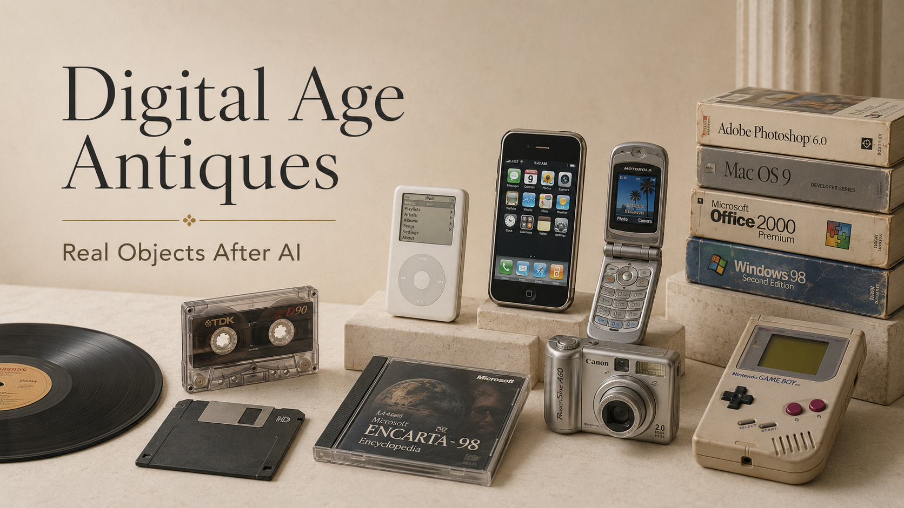

# Digital Age Antiques

**A field guide to future collectibles, early digital products, pre-AI objects, and real physical assets in the AI era.**

Created by **Xufen Tu**

---



---

## Core Observation

When everything becomes easier to generate, copy, and reproduce, real physical objects may become more meaningful.

Not simply because they are old.

But because they carry material history, human use, cultural memory, scarcity, provenance, condition, original packaging, and visible time.

**Digital Age Antiques** studies the objects that may become valuable in the AI era because they cannot be fully replaced by digital copies.

---

## What This Project Studies

This project observes the future value of real objects from the digital age and the pre-AI era.

It focuses on objects such as:

- first-generation digital devices
- old Apple products
- iPods, iPhones, Walkman devices, cameras, and game consoles
- boxed software, CD-ROMs, floppy disks, and early internet-era products
- cassette tapes, vinyl records, CDs, and VHS
- vintage toys and action figures
- music memorabilia and pop culture objects
- everyday objects that may become future collectibles

The goal is not to predict prices with certainty.

The goal is to build a human judgment framework for identifying which objects may still matter when digital abundance becomes normal.

---

## The Central Question

**What becomes valuable when digital abundance becomes normal?**

This project asks:

- What will be valuable after AI?
- What real objects can AI not fully copy?
- What early digital products may become future antiques?
- What old items should people not throw away?
- How do we recognize real antiques, future collectibles, and physical authenticity?
- Why do packaging, condition, scarcity, and provenance matter?
- Which objects from the early digital age may become cultural evidence?

---

## Project Map

| Section | Purpose |
|---|---|
| 🕰️ What Will Be Valuable After AI | Observes future value after digital abundance |
| 📦 Early Digital Products | Studies first-generation digital devices and pre-AI objects |
| 🧩 Value Signals | Defines the judgment signals used by this project |
| 🔍 How to Identify Real Antiques | Records authenticity, condition, provenance, and object-level checks |
| 🧾 Future Collectibles | Tracks objects that may become future cultural and collector items |
| 🏛️ AI-Era Physical Assets | Studies real physical assets in an AI-generated world |
| ⚖️ Real vs Fake Objects | Observes reproduction, authenticity, and trust boundaries |
| 📝 Case Studies | Documents specific object-level observations |
| ✅ Buying Checklists | Provides non-financial observation checklists |
| 📊 Market Notes | Records public market signals and field observations |
| 🖼️ Images | Stores diagrams, case photos, and visual materials |

---

## Value Signals

An object is not valuable simply because it is old.

Future value may appear when several signals come together:

| Signal | Meaning |
|---|---|
| Cultural Memory | The object represents a person, brand, technology, era, or lifestyle people remember. |
| Physical Authenticity | The object is real, material, original, and not just a digital image or reproduction. |
| Scarcity | It is difficult to find, especially in good condition. |
| Condition | The object is clean, preserved, working, or visually strong. |
| Completeness | Box, manual, cables, inserts, stickers, accessories, or packaging are still present. |
| Provenance | The origin, ownership, purchase history, or context can be explained. |
| Display Value | The object can be placed, shown, photographed, or used as a cultural object. |
| Story Value | The object carries a story beyond its original function. |
| Buyer Demand | Collectors, fans, designers, creators, or ordinary people still want it. |
| Human Judgment | Final value requires context, timing, culture, condition, and interpretation. |

---

## Early Digital Products

Early digital products are not only obsolete devices.

They are physical evidence of the first transition from analog life to digital life.

Examples include:

- first-generation iPhone
- early iPods
- old Apple computers
- Sony Walkman and Discman
- BlackBerry and Nokia phones
- Motorola Razr
- early digital cameras
- old camcorders
- early game consoles
- boxed software
- CD-ROMs
- floppy disks
- early internet devices
- discontinued consumer electronics

These objects may become future antiques because they represent how humans first entered digital life.

Later versions may be more advanced.

But first-generation objects often carry origin value.

---

## Human Judgment Position

Digital systems can estimate, compare, and generate.

But they cannot fully replace human judgment about:

- why an object matters
- who remembers it
- whether it feels culturally alive
- whether its condition is acceptable
- whether its story is strong
- whether the object belongs to a future market

This project treats future value as a judgment problem, not only a pricing problem.

The deeper question is not only:

**What is the price today?**

The deeper question is:

**What kind of object may people still care about when digital abundance becomes normal?**

---

## Commercial Direction

This project may later support educational guides, observation templates, value-signal checklists, case cards, research-based content products, and digital-age collectible reports.

It does not provide certified appraisal, investment advice, guaranteed resale predictions, or professional authentication services.

The commercial value of this project is not based on promising that objects will rise in price.

It is based on building a clearer way to observe real objects, cultural memory, physical authenticity, and future value signals in the AI era.

---

## Case Study Approach

This repository will document real object observations using case cards.

Each case study may include:

- item name
- category
- era
- brand or artist
- condition
- packaging
- market signals
- cultural memory
- provenance
- display value
- human judgment
- hold / sell / watch / avoid decision

Current case areas include:

- Michael Jackson physical collectibles
- cassette tapes and music media
- early Apple products
- vintage electronics
- old cameras
- game consoles
- boxed software
- pop culture objects

---

## Project Structure

```text
digital-age-antiques/
│
├── README.md
├── LICENSE.md
│
├── what-will-be-valuable-after-ai/
├── early-digital-products/
├── collectible-value-signals/
├── how-to-identify-real-antiques/
├── future-collectibles/
├── ai-era-physical-assets/
├── real-vs-fake-objects/
├── case-studies/
├── buying-checklists/
├── market-notes/
└── images/
```

---

## Usage Notice

This repository is for research, observation, education, and value-judgment documentation.

It does not provide financial, investment, legal, appraisal, or authentication advice.

Future value is not guaranteed.

All final buying, selling, collecting, or holding decisions remain the responsibility of the individual.

© Xufen Tu. All rights reserved.

---

<details>
<summary>Search terms covered by this project</summary>

digital age antiques, future antiques, future collectibles, what will be valuable after AI, AI-era physical assets, real objects AI cannot copy, early digital products, early digital devices, pre-AI objects, pre-AI collectibles, old iPhones worth money, old iPods worth money, old Apple products value, vintage electronics value, old game consoles worth money, boxed software value, CD-ROM collectibles, cassette tapes future value, vinyl records future value, vintage toys future value, how to identify real antiques, how to tell if an old item is valuable, physical authenticity, provenance, cultural memory, scarcity, condition, original packaging, human judgment for future value.

</details>
